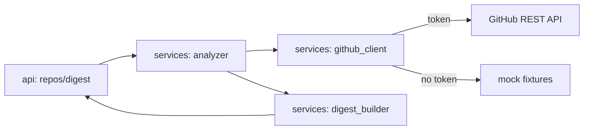

# agent-github-intel

[](https://github.com/Shamanchi/agent-github-intel/actions/workflows/ci.yml)
[](https://www.python.org/)
[](./Dockerfile)
[](./LICENSE)

> **English TL;DR:** FastAPI agent that turns any public GitHub repo into a health digest: activity velocity, PR review load, stale issues, bus factor. Works offline with mock fixtures — no token needed for demo and CI.

Агент аналитики GitHub-репозиториев: по `owner/repo` строит дайджест здоровья проекта — активность, нагрузка на ревью, зависшие issue/PR, bus factor контрибьюторов. Демо и тесты работают без токена (mock-режим).

Источник темы: `Hands-On-AI-Engineering / P-124 (github_intelligence_agent)` — идею и постановку взяли из каталога, код и тексты написаны с нуля.

## Какую задачу решает

Мейнтейнеру и тимлиду нужно за 1 минуту понять состояние чужого или своего репозитория: жив ли проект, где затык в ревью, какие issue гниют, насколько проект зависит от 1–2 человек. Агент собирает публичные сигналы GitHub API (или mock-фикстуры без сети) и отдаёт структурированный дайджест + сырые метрики.

## Архитектура



Слои: `api/` → `services/` → `core/`, настройки через `pydantic-settings`.

## Быстрый старт

```bash
cp .env.example .env
pip install -r requirements.txt
uvicorn app.main:app --reload
curl "http://127.0.0.1:8000/api/v1/repos/octocat/Hello-World/digest"
```

С токеном (живые данные):

```bash
# в .env: GITHUB_TOKEN=ghp_...
curl "http://127.0.0.1:8000/api/v1/repos/octocat/Hello-World/digest?live=true"
```

Docker:

```bash
docker compose up --build
```

## API

- `GET /api/v1/health` — проверка сервиса.
- `GET /api/v1/repos/{owner}/{repo}` — сырые метрики репозитория (mock без токена).
- `GET /api/v1/repos/{owner}/{repo}/digest` — markdown-дайджест + метрики JSON. Параметр `?live=true` включает GitHub API (нужен `GITHUB_TOKEN`).

Пример ответа `digest` (сокращённо):

```json
{
  "repo": "octocat/Hello-World",
  "health_score": 56,
  "activity": {"commits_30d": 18, "prs_merged_30d": 6},
  "review_load": {"open_prs": 3, "oldest_open_pr_days": 21},
  "bus_factor": {"top_contributors": ["alice", "bob"], "top2_share": 0.83},
  "stale": [{"number": 12, "title": "Flaky test", "days_open": 96}],
  "digest_md": "# octocat/Hello-World — health 56/100\n..."
}
```

## Переменные окружения (.env)

| Переменная | Назначение | По умолчанию |
|---|---|---|
| `GITHUB_TOKEN` | Токен GitHub API для `?live=true` (без него — mock) | пусто |
| `GITHUB_API_URL` | Базовый URL GitHub API | `https://api.github.com` |
| `MOCK_MODE` | Всегда отдавать фикстуры (`true`/`false`) | `true` |
| `STALE_DAYS` | Возраст issue/PR для флага stale | `30` |
| `APP_HOST` / `APP_PORT` | Хост/порт API | `0.0.0.0` / `8000` |

Полный список — в [.env.example](./.env.example).

## Тесты

```bash
pip install -r requirements.txt
pytest -q
pytest -q -m integration
```

Unit-тесты идут без сети (mock-фикстуры). Интеграционные (`-m integration`) тоже без сети по умолчанию; с `GITHUB_TOKEN` и `LIVE_GITHUB=1` один тест ходит в реальный API.

## Контакты

- Telegram: @PavelYrevichh
- Email: Lietman46@mail.ru
- GitHub: Shamanchi
- FL.ru: https://www.fl.ru/users/Shamanchi
